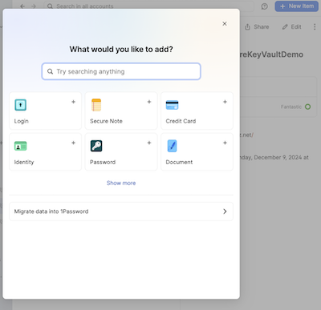
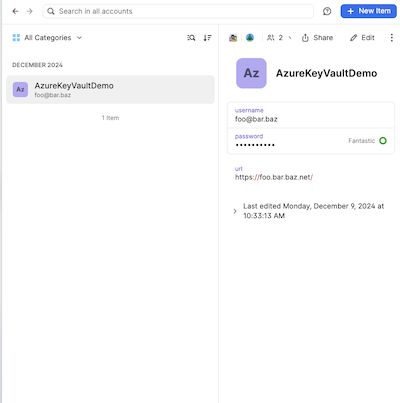

# secret-manager-1password

Retrieve Azure Key Vault URL from 1password

Add a Vault in 1password named `Test`. Then add a password-item by clicking on `+ New Item` and
select `Password` from the wizard.  

Name it `AzureKeyVaultDemo`, fill in username and password if
desired, they are not used. Then add a password-field clicking on `+ add more` with a title named `url`
and the password `https://foo.bar.baz.net/`.

